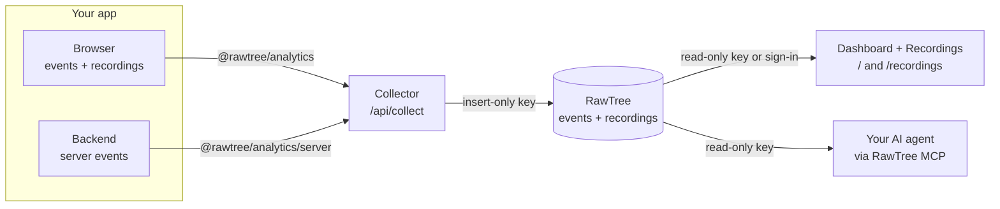

# RawTree Web Analytics

Web analytics on [RawTree](https://rawtree.com): an SDK for events and session recordings, a Next.js collector, and a dashboard with bot detection and session replay. Your events land in your own RawTree tables, so every number on the dashboard is a SQL query you can run yourself.

## 📦 What's inside

- **SDK** ([`@rawtree/analytics`](packages/analytics)): send product-defined events from the browser and your backend, plus rrweb session recordings with masking on by default. Delivery is batched, retried, and at least once.
- **Collector** (`/api/collect`): validates every batch against the event contract and writes it to RawTree with an insert-only key. It acknowledges only after RawTree accepted every row.
- **Dashboard** (`/`): Overview, Traffic, Acquisition, Content, Engagement, and Bots for any date range, compared with the previous period. Bots are told apart by user agent and kept out of every human metric.
- **Recordings** (`/recordings`): browse recent sessions and replay them in the browser.
- **Console** (`/console`): send test events, recordings, crawler visits, and campaign visits through the SDK, and watch each one reach RawTree.

The dashboard, console, and collector are one Next.js app, meant to be deployed.

## 🧭 How it works



The collector and the dashboard are the same Next.js app. Its Console page plays "Your app", sending through the same SDK to its own collect route.

- Events and recording chunks are stored as rows. Sessions, recordings, and their completeness are derived in SQL, not kept in a mutable table.
- Delivery is at least once, so event IDs stay stable across retries and every query deduplicates (`uniqExact(event_id)` or `LIMIT 1 BY`).
- `/api/collect` writes only with the insert key from server configuration. The dashboard and console use either the server's keys or the signed-in visitor's own access, and only ever run the dashboard's own SQL: never SQL or table names from the browser.

## 🌳 Set up RawTree

You need a RawTree account and the [`rtree` CLI](https://rawtree.com/docs/reference/cli). Log in once with `rtree login`, then create a database and two keys: one that can only write, one that can only read.

```sh
rtree database create web_analytics
rtree key create --name web-analytics-ingest --permission write_only --database web_analytics
rtree key create --name web-analytics-query --permission read_only --database web_analytics
```

That's it. The `events` and `recordings` tables are created on the first ingestion, and their columns appear as events arrive.

These keys apply to every database in your cluster. To limit them to the analytics database, use keys bound to [database roles](https://rawtree.com/docs/reference/authentication) instead. Role-bound inserts don't create tables, so create `events` and `recordings` first in that case.

## 🚀 Run it locally

You need Node.js 24 or later.

```sh
cp .env.example .env.local   # set RAWTREE_DATABASE, RAWTREE_INGEST_KEY, RAWTREE_QUERY_KEY
npm install
npm run dev                  # dashboard + collector on http://localhost:3000
```

[`.env.example`](.env.example) documents every variable. With both keys set, the dashboard opens without signing in. Leave `RAWTREE_QUERY_KEY` and `RAWTREE_INGEST_KEY` empty to try sign-in mode instead (see "Deploy the dashboard" below).

## 🧪 Use the console

Open **Console** in the dashboard's sidebar (`/console`). It sends data through `@rawtree/analytics` exactly as a real app would, to `/api/console/collect`: the same validation and insert path as `/api/collect`, but with your own credentials, so test data only lands in your database. It needs no allowed origin or server token.

1. **Consent:** turn on Analytics. Nothing is sent before that. Turn on Session recording too if you want a replay.
2. **Browser events:** send recipe-shaped events (`page_view`, `cta_click`, `scroll_depth`, and more) or a custom event with your own JSON.
3. **Server events:** send backend events like `signup_completed` with a stable ID, through `@rawtree/analytics/server` on the app's server. Resending keeps the same ID, and the dashboard still counts it once.
4. **Simulated traffic:** send page views as crawlers (GPTBot, ClaudeBot, Googlebot, curl, and more) or as campaign visits (Google ad, newsletter, Hacker News). Each click is a new visitor. This is how you fill the Bots and Acquisition sections.
5. **Recording playground:** change the page while recording, and check that the input, the `rr-block` region, and the sample secrets stay hidden. "Mask all text" switches to fully masked recordings.
6. **Event viewer:** every row moves from Queued to Sent (collector 200) to Stored (found in RawTree). Reads lag writes by a moment, so Stored can take a few seconds.

Everything you send goes to the database you're signed in to (or `RAWTREE_DATABASE` when the keys come from the environment). Use a separate test database (same setup, another name) if you don't want test data next to real traffic: RawTree can't delete individual rows yet.

## 📊 Use the dashboard

- **Sign in:** only in sign-in mode. Connect with RawTree or paste an API key, and the sidebar shows which database you're looking at and a Sign out button.
- **Date range:** the picker in the header has presets (Today, This week, Last 7 days, Last month, and more) and a calendar for custom ranges. Days are UTC. Every number is compared with the previous period of the same length.
- **Humans only:** once events carry a user agent, every section except Bots excludes them. Before that, the sections show an "All traffic" badge.
- **Sections:** Overview has the headline numbers. Traffic has the daily trend and breakdown. Acquisition shows channels, referrers, and UTM campaigns by each session's first touch. Content lists top pages. Engagement covers time on page, scroll depth, and CTA clicks. Bots shows bot page requests, crawler types, top crawlers, and the most crawled paths.
- **Recordings:** pick a session from the list on the left and replay it. Pause, seek, and change speed from the controls under the player. Incomplete recordings replay only their complete stretches and say what was skipped.
- **Tune a widget:** every dashboard query lives in [`lib/queries.ts`](lib/queries.ts), one documented template per widget. Edit the SQL there (for example add a channel host to `SEARCH_HOSTS` or change `ENGAGED_MS`). The aliases are the field names the page reads: if you add or rename one, update that query's row type in `lib/dashboard.ts` and its use in `app/page.tsx`.

## ☁️ Deploy the dashboard

Deploy the Next.js app (for example on Vercel) in one of two modes, chosen by its environment variables.

| Variable | Value |
| --- | --- |
| `RAWTREE_API_URL` | Optional. Defaults to `https://api.rawtree.com` |
| `RAWTREE_DATABASE` | Your analytics database (used with the env keys) |
| `RAWTREE_INGEST_KEY` | The insert-only key, used by the collector (and the console in env mode) |
| `RAWTREE_QUERY_KEY` | The read-only key, used by the dashboard and replay in env mode |
| `RAWTREE_CONNECTOR` | Optional, sign-in mode only. The Vercel Connect connector, e.g. `rawtree/web-analytics` |
| `ANALYTICS_ALLOWED_ORIGINS` | The origins of the sites you track, e.g. `https://example.com` |
| `ANALYTICS_SERVER_TOKEN` | Optional. A random secret for backend events |

Then point the SDK at `https://<your-deployment>/api/collect`. The collector always uses `RAWTREE_INGEST_KEY` and `RAWTREE_DATABASE`, in both modes. Without them it rejects events as not configured.

### Env mode: a private dashboard

Set both `RAWTREE_QUERY_KEY` and `RAWTREE_INGEST_KEY`. There is no sign-in: **anyone with the URL sees your analytics, replays recorded sessions, and can send test data from the console.** Use it on your machine or behind your own access control (for example Vercel Deployment Protection).

### Sign-in mode: a public dashboard

Leave `RAWTREE_QUERY_KEY` and `RAWTREE_INGEST_KEY` unset. Every page asks visitors to sign in with their own RawTree access, and shows only their own database:

- **Connect with RawTree** (when `RAWTREE_CONNECTOR` is set): the visitor approves access with their RawTree account through Vercel Connect, then picks the organization, cluster, and database. The browser only holds an opaque, HTTP-only session cookie; Vercel Connect stores and refreshes the grant. Sign out revokes it.
- **Use an API key:** the visitor pastes one key and a database name (default `web_analytics`). The key must **read and write** that database: the dashboard reads it and the console writes test events to it. Create one with `rtree key create --name web-analytics --permission read_write --database web_analytics`. Permission keys cover the whole cluster; a key limited to one database needs a role with `GRANT SELECT, INSERT ON web_analytics.*`, and then create the tables first. The key is kept in an HTTP-only session cookie until sign-out or the browser closes.

RawTree OAuth grants are not read-only, so the server only runs the dashboard's own queries ([`lib/queries.ts`](lib/queries.ts)) and collector-validated inserts with them. It never accepts SQL or table names from the browser.

To enable Connect, create a Vercel Connect connector for the RawTree API from the linked project directory and expose its UID as `RAWTREE_CONNECTOR`:

```sh
vercel link
vercel connect create rawtree --target api --name <name>
vercel env add RAWTREE_CONNECTOR   # e.g. rawtree/<name>
vercel env pull                    # for local development: gives the SDK the project's OIDC token
```

Connect needs a Vercel deployment (or `vercel env pull` locally). Elsewhere, visitors sign in with an API key.

### Before you deploy

- **The collector accepts events from the allowed origins** and doesn't rate limit. Origin checks stop other websites' browsers, not scripts, so add rate limiting for `/api/collect` on your platform if you need it (for example a firewall rule on Vercel).
- **Recordings replay what was recorded.** Keep recordings masked (the default) unless you're sure about what your pages show.

## ✍️ Add it to your app

```sh
npm install @rawtree/analytics
npm install rrweb@^2.1.7   # only if you use session recording
```

```ts
import { createAnalytics } from "@rawtree/analytics";

// Create the client only after the user allows analytics.
const analytics = createAnalytics({ endpoint: "https://<your-deployment>/api/collect" });
analytics.sendEvent("checkout_started", { plan: "pro" });
```

Then query it, counting each event once:

```sql
SELECT toString(properties.plan) AS plan, uniqExact(toString(event_id)) AS checkouts
FROM events
WHERE toString(event_name) = 'checkout_started'
GROUP BY plan
```

Nothing is tracked automatically: event names and properties are yours. The [SDK README](packages/analytics/README.md) covers options, backend events, and recording privacy. The [tracking recipes](examples/recipes/RECIPES.md) show page views, CTA clicks, scroll depth, web vitals, signups, and their queries.

## 🤖 Ask your AI agent

Any AI agent or LLM client that speaks MCP can query your analytics through the [RawTree MCP server](https://rawtree.com/docs/reference/mcp). Follow the docs to connect your client of choice, and [use an API key](https://rawtree.com/docs/reference/mcp#hosted-mcp-with-an-api-key) instead of OAuth: give it the **read-only key** from the setup. OAuth grants broad access to your RawTree account, including destructive operations, while the read-only key can only read data.

Give the agent these rules so its numbers match the dashboard:

- Tables: `events` (one row per event) and `recordings` (one row per recording chunk part).
- Delivery is at least once. Count with `uniqExact(toString(event_id))`, never `count()`. Sessions are `uniqExact(toString(session_id))`, visitors are `uniqExact(toString(anonymous_id))`.
- Fields are dynamic JSON. Cast them: `toString(event_name)`, `CAST(occurred_at_ms AS Int64)`, `toString(properties.plan)`.
- Time is `occurred_at_ms` (epoch milliseconds, UTC). Always filter on an explicit window.
- Page views are `event_name = 'page_view'`, with `page_path`, `page_url`, and `referrer` on the row.
- Bots are told apart by `user_agent`. The dashboard's pattern is `BOT_UA_PATTERN` in [`lib/crawlers.ts`](lib/crawlers.ts).

The [tracking recipes](examples/recipes/RECIPES.md) and [`lib/queries.ts`](lib/queries.ts) (every dashboard query) have more queries to borrow from.

## 🔒 Privacy notes

- Session recording masks all text and inputs by default. `maskAllText: false` shows page text while inputs stay masked. Elements with `rr-block` are never recorded.
- Page URLs keep only allowlisted query parameters (`utm_*` by default) and drop credentials and fragments.
- RawTree can't delete individual rows yet, so plan retention before collecting real users.

## 🛠️ Development

```sh
npm test             # builds the SDK, runs SDK and collector/dashboard tests
npm run typecheck
npm run build        # SDK + Next.js
```

Automated tests never touch your real tables: they use temporary tables named with `RAWTREE_TABLE_PREFIX`. Node runs the `.ts` sources directly, so use erasable syntax only and `.ts` extensions in relative imports.

| Path | What |
| --- | --- |
| `packages/analytics/` | The SDK. `src/protocol.ts` is the event contract for both the SDK and the collector |
| `app/`, `components/` | Dashboard, recordings, console, and the collector routes |
| `lib/` | Collector, RawTree client, dashboard SQL, crawler classifier, recording reassembly |
| `examples/recipes/` | Tracking recipes (typechecked against the SDK) |
| `test/` | Collector and dashboard tests |
| `IMPLEMENTATION.md` | Plan, milestones, and the session ledger |
| `AGENTS.md` | Guide for coding agents working in this repo |

## 📄 License

[Apache-2.0](LICENSE)
